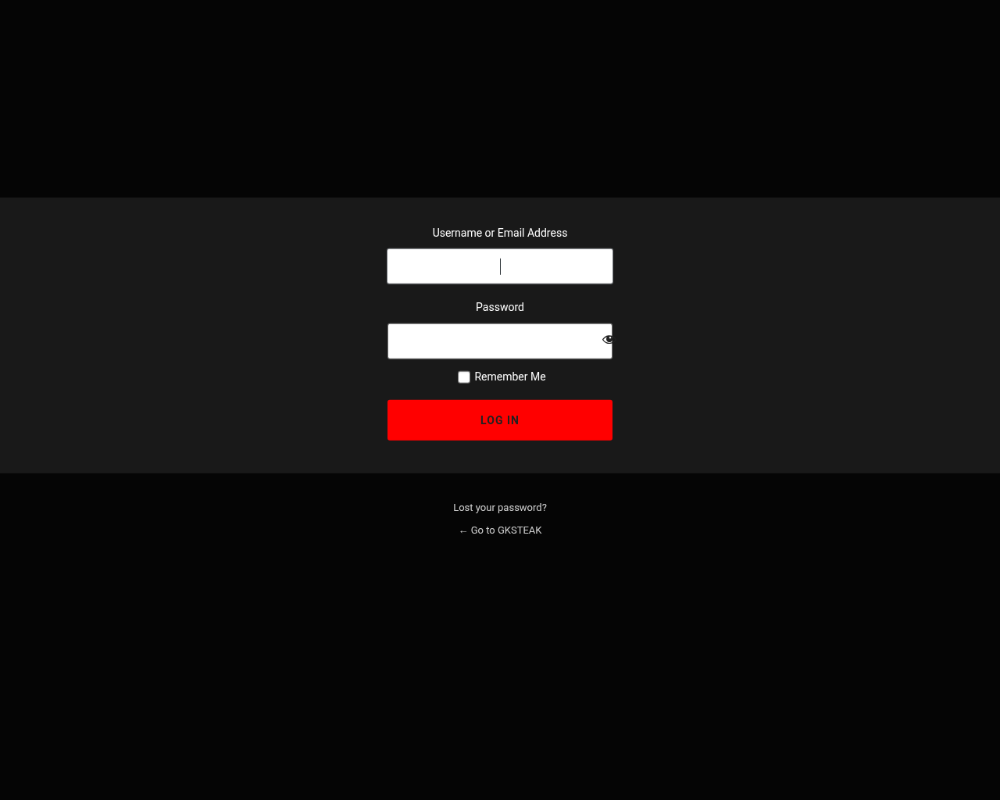

# GKSteak Web (Archive Restoration)

> **TENTANG PROJECT INI**
>
> Project ini adalah **arsip website lama GKSteak** yang telah dihidupkan kembali (*revived*). 
> Saya mencoba memulihkan website ini dari file backup lawas dan mengemasnya ke dalam environment **Docker**.

---

Website ini sekarang sudah siap deploy (Plug & Play) menggunakan Docker Compose.

**🌐 Live Demo:** [https://restaurant.widifirmaan.web.id](https://restaurant.widifirmaan.web.id)

## 📸 Tampilan / Screenshots

Berikut adalah cuplikan tampilan dari website yang telah berhasil di-restore:

| **Halaman Depan (Home)** | **Daftar Menu** |
| :---: | :---: |
| [](screenshots/home.png) | [](screenshots/menu.png) |
| **Tentang Kami (About)** | **Halaman Login** |
| [](screenshots/about.png) | [](screenshots/login.png) | 

## 📋 Prasyarat

Sebelum menjalankan project ini, pastikan PC atau Server Anda sudah terinstal:

*   [Docker Engine](https://docs.docker.com/engine/install/)
*   [Docker Compose](https://docs.docker.com/compose/install/)

## 🚀 Cara Menjalankan (Deployment)

Tidak perlu restore manual atau konfigurasi rumit. Database dan file sudah disiapkan.

1.  **Clone/Copy** folder project ini ke komputer/server Anda.
2.  Buka terminal di dalam folder project.
3.  Jalankan perintah:

    ```bash
    docker compose up -d
    ```

    *Perintah ini akan mendownload image (WordPress 5.8 & MariaDB), membuat container, dan otomatis mengimport database lama dari `init.sql`.*

4.  Tunggu sejenak (1-2 menit) untuk proses inisialisasi database.
5.  Akses website melalui browser:
    *   **Frontend**: [http://localhost:8082](http://localhost:8082)
    *   **Dashboard Admin**: [http://localhost:8082/wp-admin](http://localhost:8082/wp-admin)

## 🔑 Informasi Login

Berikut adalah kredensial yang telah di-reset untuk akses admin:

*   **Username**: `gksteak`
*   **Password**: `gksteak123`

## 📂 Struktur Project

Berikut adalah file-file kunci dalam restorasi ini:

*   **`docker-compose.yml`**: Konfigurasi server virtual. Menjalankan PHP 7.4 (WordPress 5.8) dan MariaDB 10.6.
*   **`init.sql`**: Dump database hasil restorasi yang berisi seluruh postingan, page, dan pengaturan lama. File ini otomatis di-load saat container pertama kali dibuat.
*   **`wp-config.php`**: File konfigurasi inti yang telah dimodifikasi (hardcoded table prefix `wp2o_`) menyesuaikan struktur database lama.
*   **`wp-content/`**: Folder aset asli (Themes, Plugins, Uploads) yang terhubung langsung ke container.

## 🛠️ Riwayat Modifikasi & Perbaikan

Untuk membuat arsip ini berjalan di environment lokal (`localhost`), beberapa penyesuaian teknis telah dilakukan:

1.  **Database URL Replacement**:
    Seluruh link di database telah diubah dari domain lama `http://www.gksteak.com` menjadi `http://localhost:8082`.
    
2.  **Table Prefix Fix**:
    Backup asli menggunakan prefix database `wp2o_`. Konfigurasi WordPress disesuaikan secara manual karena environment variable standar tidak mendeteksi prefix ini.

3.  **Tweak Tampilan (Theme Customization)**:
    Dilakukan sedikit modifikasi pada plugin/tema untuk kerapian:
    *   Judul menu dibuat rata tengah (`text-align: center`).
    *   Menghilangkan simbol mata uang `$` pada harga menu.
    *   *Lokasi File*: `wp-content/plugins/food-and-drink-menu/fdm-templates/content/`

4.  **Autorun (Start-on-Boot)**:
    Container dikonfigurasi dengan `restart: always`. Artinya:
    *   Jika container crash, ia akan restart otomatis.
    *   Jika server/komputer di-reboot, **WordPress akan otomatis menyala** (selama service Docker diaktifkan pada sistem operasi).

## ❓ Troubleshooting

*   **Website tidak bisa dibuka?**
    Cek status container dengan `docker ps`. Jika baru dijalankan, tunggu sebentar karena database sedang proses import.
*   **Ingin reset database ke kondisi awal backup?**
    Hapus volume database dan restart docker:
    ```bash
    docker compose down -v
    docker compose up -d
    ```
